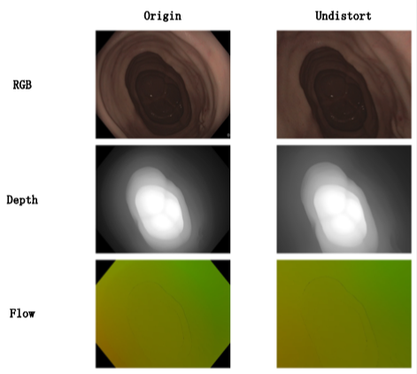

# OpenCV-KB-Fisheye Lens Correction Toolkit 

[](https://www.python.org/downloads/release/python-360/)
[](https://opencv.org/)

A comprehensive toolkit for fisheye camera calibration and image undistortion based on the Kannala-Brandt model implemented in OpenCV.

## ✨ Features
- 📷 Opencv KB fisheye Camera calibration
- 🔄 Fisheye image undistortion

## 🛠️ Installation

### Conda Environment Setup
```bash
conda create -n fisheye-py36 python=3.6
conda activate fisheye-py36
```

### Dependecy Installation
To get started, you need to clone the repository and install the necessary dependencies.

```bash
git clone https://github.com/Blue00101/opencv-KB-fisheye.git
cd opencv-KB-fisheye
pip install -r requirements.txt
```

## Run
### Fisheye camera calibration
Looking for **Calibration** part of the codes
### Image Undistortion
Looking for **Undistort** part of the codes

## Exmaple


## LICENSE
MIT license
